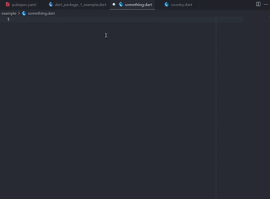
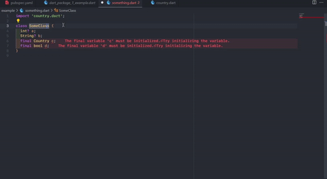
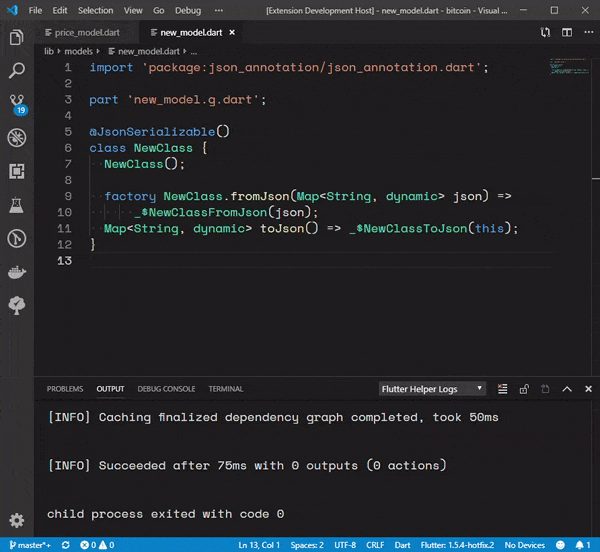
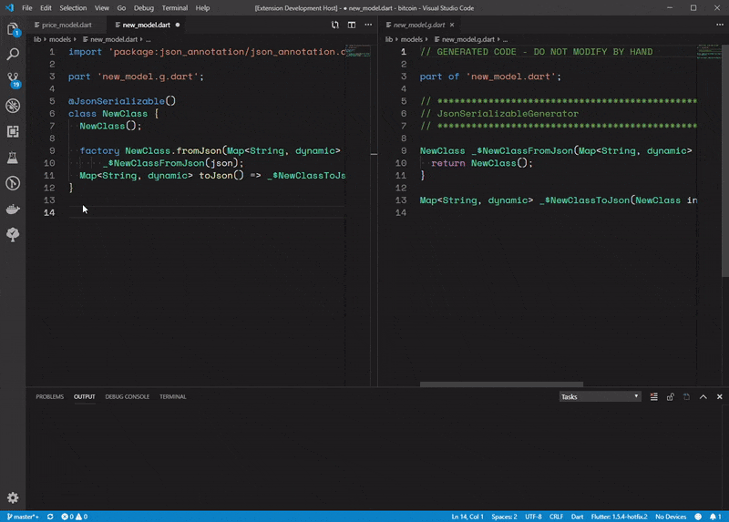

# dart-json-serializable-helper README

To help generate @JsonSerializable classes

## Credits

[VsCode Flutter Helper](https://github.com/aksharpatel47/vscode_flutter_helper)

## Features

### Snippet to generate @JsonSerializable class

   

### Hover over a class and press `Ctrl + .` on Windows, `Cmd + .` on Mac to convert a class to a JsonSerializable class

   

### Run Code Gen for @JSONSerializable annotated classes

### Have build runner watch the @JSONSerializable annotated classes and generate code on changes

## Release Notes

### 1.0.0

Initial release
